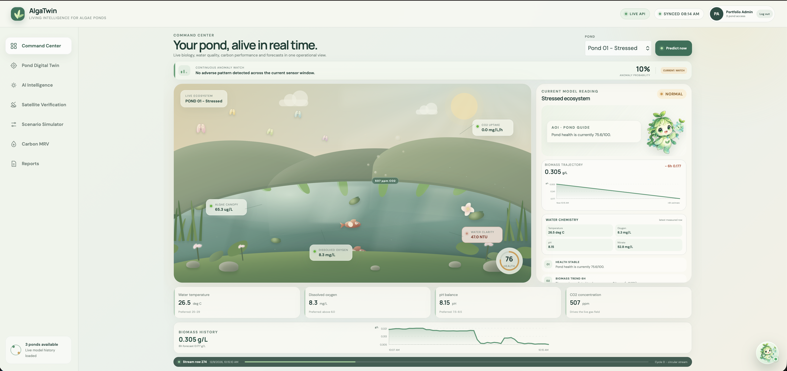
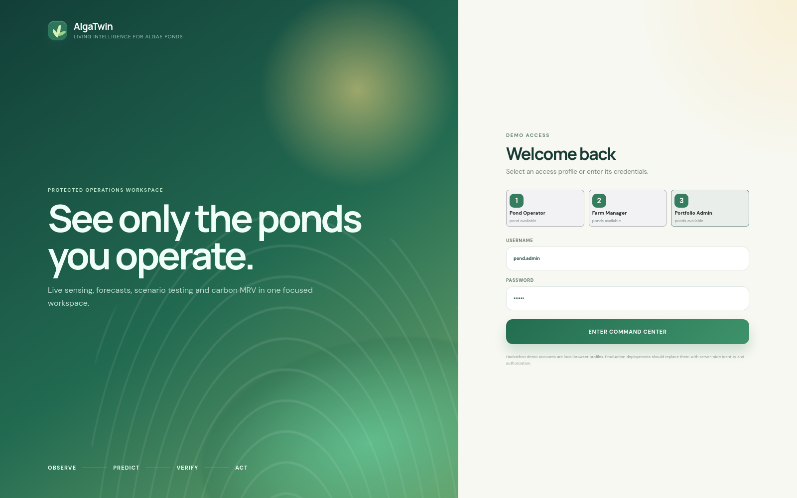
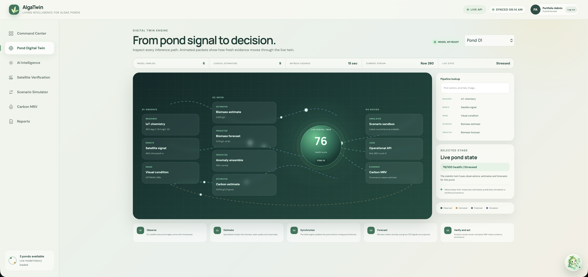
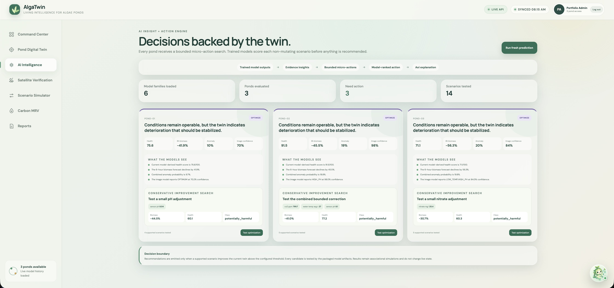
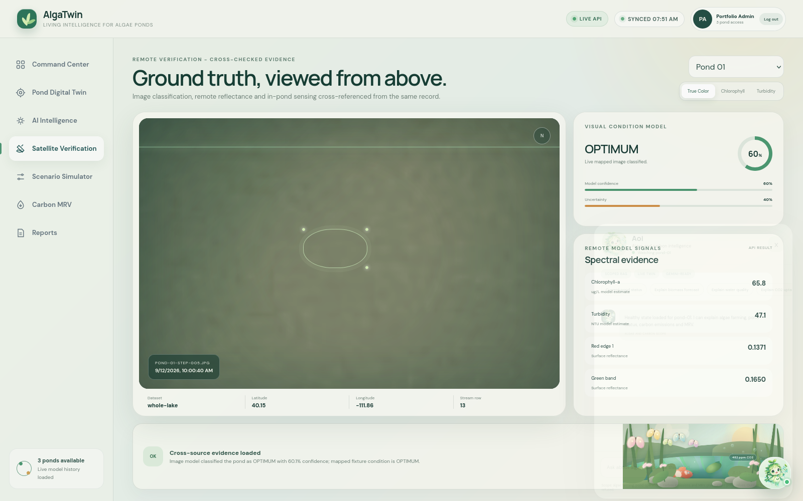
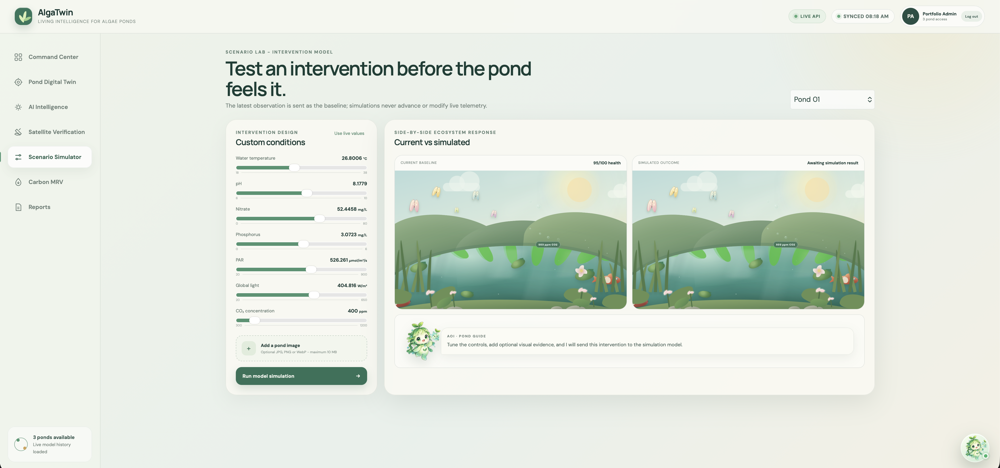
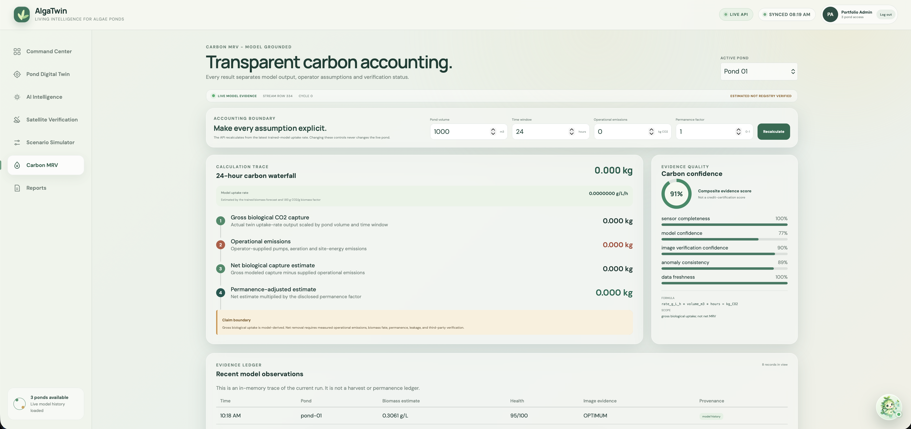
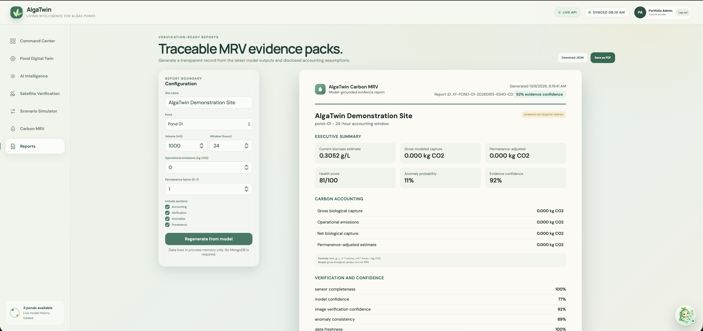
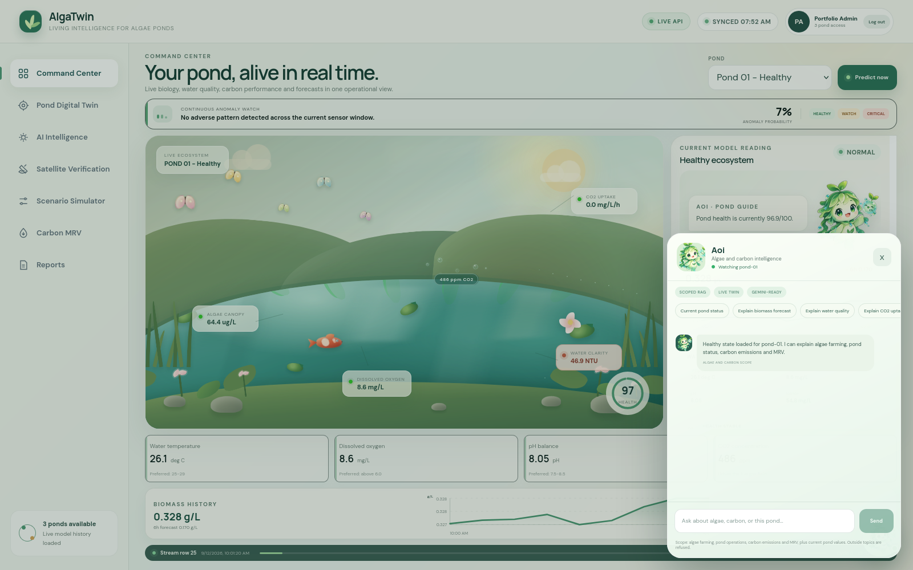

# Team O(N3)

## AlgaTwin - living intelligence for algae ponds

AlgaTwin is a model-backed digital twin and carbon MRV workspace for algae farms. It turns pond telemetry, satellite reflectance and visual evidence into an always-current operational picture: biomass estimates, short-horizon forecasts, anomaly warnings, bounded corrective scenarios and provenance-aware carbon accounting.



> One pond view. Six model families. Fifteen-second updates. Every output keeps its evidence type.

Built for HackOut'26 by Team O(N3).
- Nishant Asnani
- Deep Bhatt
- Kajal Varlani

## The problem

Algae can convert CO2 into biomass, but an operator still has to answer three difficult questions:

1. Is the pond healthy right now?
2. What is likely to happen next, and what small change should we test?
3. Which carbon number is measured, modeled, simulated or actually verified?

These questions are usually split across sensor tables, research models, image reviews and spreadsheets. That separation slows intervention and makes carbon claims difficult to audit.

## Our solution

AlgaTwin makes the digital twin the central intelligence layer:

- a circular 999-row stream represents gradual IoT and satellite conditions for three independent ponds;
- a FastAPI service loads all model artifacts once and maintains a separate stateful twin per pond;
- the React command center refreshes the prediction cycle every 15 seconds;
- animated pond signals make temperature, health, stress and CO2 intensity understandable at a glance;
- a bounded scenario engine ranks small corrective actions without changing live state;
- a carbon MRV layer exposes its boundary, factors, assumptions, uncertainty and provenance;
- Aoi answers only algae-farming, pond-operation and carbon/MRV questions, using retrieved knowledge and current model evidence.

No MongoDB is required for the hackathon run. Prediction and simulation history are bounded in process memory.

## Why this is different

### A living interface, not another sensor grid

The main scene is composed in the frontend as a responsive ecosystem. Its visual state changes with the model response:

- health state changes the pond atmosphere and warning treatment;
- CO2 controls the count, size and release cadence of gas bubbles;
- pond life and ambient motion create a continuously active scene;
- warnings, health rings and chemistry cards change tone when conditions deteriorate;
- the Digital Twin Engine animates inference packets through observation, model, state and decision paths;
- reduced-motion preferences are respected.

### Decisions remain traceable

AlgaTwin separates five evidence classes throughout the interface and API:

| Evidence class | Meaning |
| --- | --- |
| Measured/replayed | IoT values from the current stream row |
| Estimated | Biomass, chlorophyll-a, turbidity and gross uptake derived by models |
| Predicted | Future biomass and anomaly outputs |
| Simulated | Counterfactual scenario results that never alter live state |
| Verified | Evidence that has completed an explicit verification step |

This prevents a simulation from being presented as an observation and prevents gross modeled uptake from being presented as a certified credit.

### Models decide; Gemini explains

Aoi is not a generic chatbot. Every question passes a deterministic scope guard before any model call. In-scope questions retrieve curated algae/carbon knowledge and, where available, current digital-twin evidence. Gemini can rewrite that grounded draft, but it cannot introduce an unsupported action or answer an outside topic.

## End-to-end approach

```text
Circular pond stream (999 rows, 3 ponds)
              |
              v
POST /predict every 15 seconds
              |
      +-------+--------+
      |       |        |
      v       v        v
   Pond 01  Pond 02  Pond 03
   isolated stateful digital twins
      |       |        |
      +-------+--------+
              |
   +----------+-----------+--------------+
   |          |           |              |
   v          v           v              v
Biomass    Forecast    Anomaly       Remote/image
estimate   6h / 24h   + health       supporting evidence
   |          |           |              |
   +----------+-----------+--------------+
              |
        Dashboard JSON
              |
     +--------+---------+----------------+
     |                  |                |
     v                  v                v
Command Center     Scenario Lab      Carbon MRV
```

A scenario starts from the currently streamed row, applies bounded custom changes, returns model-scored JSON, and leaves both the live state and stream cursor unchanged.

## Model inventory

The service loads six artifact families containing nine logical estimators.

| Runtime capability | Validation result | Runtime policy |
| --- | --- | --- |
| Current AFDW biomass | MAE 0.0692 g/L, R2 0.280 on held-out ATP3 experiments | Active |
| Near-6h biomass | MAE 0.0563 vs persistence MAE 0.1312 | Active |
| Near-24h biomass | MAE 0.0579 vs persistence MAE 0.0567 | Trained model gated off; safer persistence fallback |
| Crash risk | ROC-AUC 0.675; AP 0.067 vs 0.030 prevalence | One anomaly component |
| Isolation Forest novelty | Unsupervised ATP3 reference envelope | One anomaly component |
| Image condition | 0.684 accuracy vs 0.545 majority baseline | Supporting evidence |
| Satellite chlorophyll-a | R2 0.995 on future-date Utah Lake holdout | Remote pathway only |
| Satellite turbidity | R2 0.916 on future-date Utah Lake holdout | Remote pathway only |
| CO2 next-day growth | R2 -0.541 on leave-one-experiment-out study | Direct model gated off; bounded empirical contrast |

Full assumptions, limitations and runtime measurements are in [the model card](model-api/MODEL_CARD.md). Exact metrics are machine-readable in [model_manifest.json](model-api/models/model_manifest.json).

## Product walkthrough

### 1. Access profiles

Three local demo identities show pond-level access without requiring a database.

| Profile | Username | Password | Ponds |
| --- | --- | --- | --- |
| Pond Operator | `pond.one` | `algae1` | Pond 01 |
| Farm Manager | `pond.team` | `algae2` | Pond 01 and Pond 02 |
| Portfolio Admin | `pond.admin` | `algae3` | All three ponds |

These are hackathon-only browser profiles, not production authentication. See [DEMO_ACCESS.md](DEMO_ACCESS.md).

### 2. Command Center

The desktop command center fits in one viewport and combines the living pond, anomaly watch, model reading, scaled biomass trajectory, chemistry, history and stream position.

### 3. Digital Twin Engine

An inspectable pipeline shows how IoT, satellite and image observations flow into the biomass, forecast, anomaly and carbon models, then into scenario, JSON and MRV outputs. Animated packets take several paths through the graph, and the lookup panel explains every stage.

### 4. AI Intelligence

Every visible pond receives a bounded micro-action search. Candidate temperature, pH, nitrate and CO2 adjustments are evaluated by the packaged digital-twin simulator. The highest-ranked evaluable micro-action is shown with expected biomass, health and classification; it is always labeled simulated.

### 5. Remote verification and scenarios

Satellite and image outputs are supporting evidence with dataset-specific provenance. The scenario lab compares current and counterfactual ponds side by side and guarantees `live_state_changed: false` and `cursor_advanced: false`.

### 6. Carbon MRV and reports

Users define pond volume, accounting window, operational emissions and a permanence factor. The API returns gross biological capture, net estimate, permanence-adjusted estimate, confidence factors and provenance. Reports export the same evidence as JSON or a printable PDF view.

## Screenshot gallery

All screenshots below were captured from the running application at 1600 x 1000.

### Login and live operations

<table>
  <tr>
    <td width="50%"><br><b>Role-based demo access</b></td>
    <td width="50%"><br><b>Single-viewport Command Center</b></td>
  </tr>
</table>

### Digital twin and AI decisions

<table>
  <tr>
    <td width="50%"><br><b>Inspectable animated inference flow</b></td>
    <td width="50%"><br><b>Model-ranked corrective micro-actions</b></td>
  </tr>
</table>

### Verification and intervention

<table>
  <tr>
    <td width="50%"><br><b>Remote and visual supporting evidence</b></td>
    <td width="50%"><br><b>Non-mutating intervention simulator</b></td>
  </tr>
</table>

### Carbon evidence and reporting

<table>
  <tr>
    <td width="50%"><br><b>Transparent carbon accounting</b></td>
    <td width="50%"><br><b>Exportable evidence report</b></td>
  </tr>
</table>

### Scoped Aoi assistant



Aoi opens from a small floating control, stays out of the operational layout until requested, and refuses unrelated questions before Gemini is called.

## API surface

Default local model API: `http://127.0.0.1:8000`

| Method | Endpoint | Purpose |
| --- | --- | --- |
| GET | `/health` | Model registry and stream readiness |
| GET | `/models` | Machine-readable model manifest |
| POST | `/predict` | Consume the next circular stream rows and run the full model stack |
| GET | `/dashboard` | Read latest state, history and last simulation without advancing the stream |
| POST | `/simulate` | Apply custom conditions or an image to the current streamed baseline |
| GET | `/ponds/{pond_id}/ai-insights` | Return findings and model-ranked scenarios |
| GET | `/ponds/{pond_id}/mrv` | Calculate a provenance-aware carbon estimate |
| POST | `/assistant/chat` | Return a scope-guarded, evidence-grounded Aoi response |

Detailed payloads are documented in [API_USAGE.md](model-api/API_USAGE.md), with the machine-readable contract in [API_CONTRACT.json](model-api/API_CONTRACT.json).

## Run locally

### Prerequisites

- Node.js 18 or newer
- Python 3.10 or newer
- npm

### One-command hackathon run

```bash
cd O-N3-AlgaTwin
bash scripts/dev.sh
```

Open:

- application: http://127.0.0.1:5173
- FastAPI documentation: http://127.0.0.1:8000/docs
- model health: http://127.0.0.1:8000/health

The launcher uses the compatible project Python environment when present, enables polling for file watching on shared/HPC machines, starts the model API, and starts Vite.

### Optional Gemini explanation layer

```bash
cp model-api/.env.example model-api/.env
# Add GEMINI_API_KEY manually
bash scripts/dev.sh
```

The key remains server-side. Without it, the deterministic retrieval response remains fully functional. Scope policy is documented in [KNOWLEDGE_BASE.md](model-api/KNOWLEDGE_BASE.md).

## Example API calls

Advance one row per pond:

```bash
curl -X POST http://127.0.0.1:8000/predict \
  -H "Content-Type: application/json" \
  -d '{"batch_size":3,"include_images":true,"return_image_base64":false}'
```

Test a scenario against the current Pond 02 baseline:

```bash
curl -X POST http://127.0.0.1:8000/simulate \
  -H "Content-Type: application/json" \
  -d '{
    "pond_id":"pond-02",
    "changes":{
      "water_temp_avg_c":27.5,
      "nitrate_mg_l":50,
      "co2_ppm":700
    }
  }'
```

Read dashboard-ready JSON:

```bash
curl "http://127.0.0.1:8000/dashboard?pond_id=pond-02&limit=48"
```

## Repository map

```text
O-N3-AlgaTwin/
|-- frontend/              React interface and animated ecosystem
|-- model-api/             FastAPI, model registry and inference endpoints
|   |-- alga_twin_api/     Stream, twin, decision, MRV and scoped RAG logic
|   |-- models/            Packaged trained artifacts and manifest
|   |-- data/              999-row three-pond stream and mapped images
|   |-- tests/             Integration and safety tests
|-- docs/screenshots/      Captured product walkthrough
|-- scripts/dev.sh         MongoDB-free development launcher
|-- DEMO_ACCESS.md         Demo profile behavior and credentials
```

The legacy Node backend remains in the repository for future persistence integration, but the default application does not start it or require MongoDB.

## Verification

The current submission passes:

```text
Frontend lint:          passed
Frontend production:    passed
Model API tests:        10 passed
Model artifacts:        loaded once at startup
Stream rows:            999
Ponds per cycle:        3
Default refresh:        15 seconds
```

Run the same checks:

```bash
cd frontend
npm run lint
npm run build

cd ../model-api
PYTHONPATH=. pytest -q
```

## Responsible claims and limitations

- AlgaTwin is a decision-support prototype, not an autonomous actuator controller.
- The satellite pathway carries Utah Lake-specific calibration provenance.
- Sparse crash labels limit anomaly certainty.
- Image classes are imbalanced and image results remain supporting evidence.
- The 24-hour learned forecast and direct CO2-growth model are runtime-gated because they did not outperform their safety baselines.
- Gross biological uptake is not a net carbon credit.
- Registry-grade MRV still requires a defined methodology, calibrated field instrumentation, lifecycle emissions, permanence treatment and independent verification.

The value of the prototype is not that uncertainty disappears. It is that uncertainty, provenance and runtime gates become visible to the operator.

## Team O(N3)

- Nishant Prakash Asnani - Backend Developer
- Deep Bhat - AI/ML Developer
- Kajal Varlani - Frontend Developer

Built for HackOut'26.
